# PROXMOX'A TALOS KURULUM REHBERİ 🚀

---

Bu rehber, **Proxmox** üzerinde **Talos** işletim sistemini çalıştırmak isteyenler için adım adım talimatlar içermektedir. **Proxmox'un kurulu olduğu varsayılmaktadır.** Eğer henüz yüklemediyseniz, [Proxmox'un indirme sayfasına](https://www.proxmox.com/en/downloads) göz atabilirsiniz.

---

## 🛠 **1. `talosctl` Kurulumu**

Talos'u yönetmek için `talosctl` aracını yükleyin:

```bash
sudo curl -Lo /usr/local/bin/talosctl https://github.com/siderolabs/talos/releases/latest/download/talosctl-linux-amd64
sudo chmod +x /usr/local/bin/talosctl
talosctl version
```

---

## 🔽 **2. ISO Dosyasını İndirme**

ISO dosyasını indirmek için [Talos Factory](https://factory.talos.dev/) sayfasına gidin ve **Bare-metal** seçeneğini seçin.

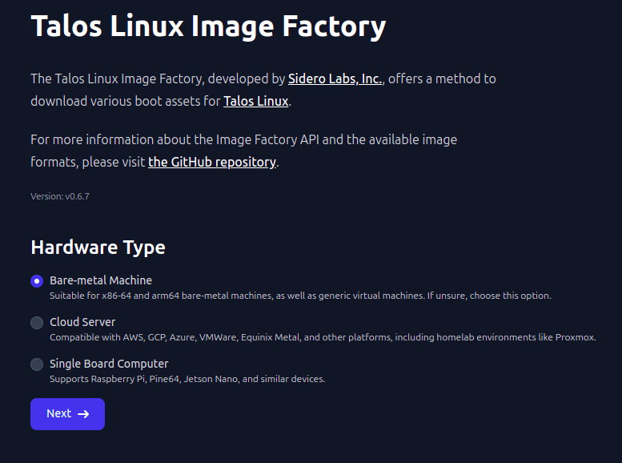

Kullanacağınız sürümü belirleyin:

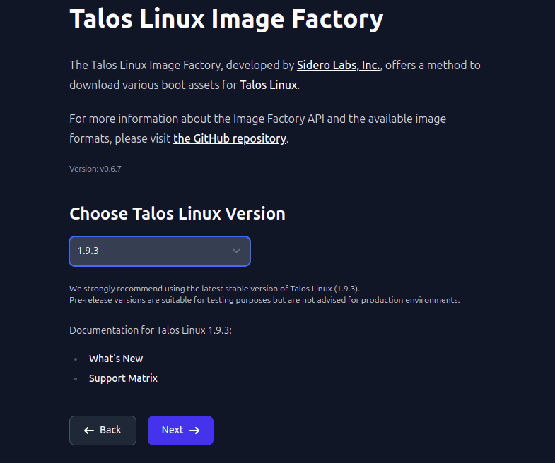

**`amd64`** seçeneğini işaretleyin:

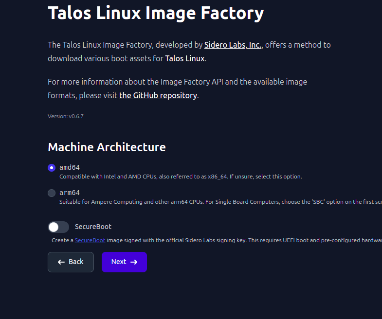

Arama çubuğuna **qemu** yazın ve listelenen **agent** seçeneğini tıklayın:

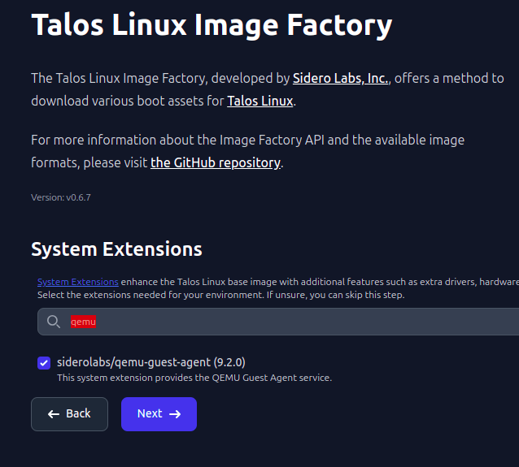

Ardından **Next** butonuna tıklayın:

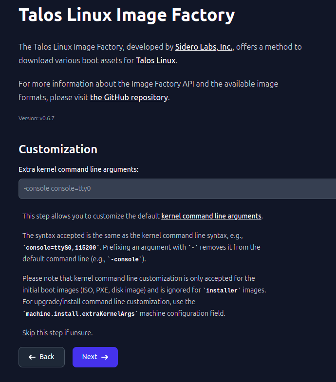

Buradan uygun formatı seçerek ISO dosyanızı indirin:

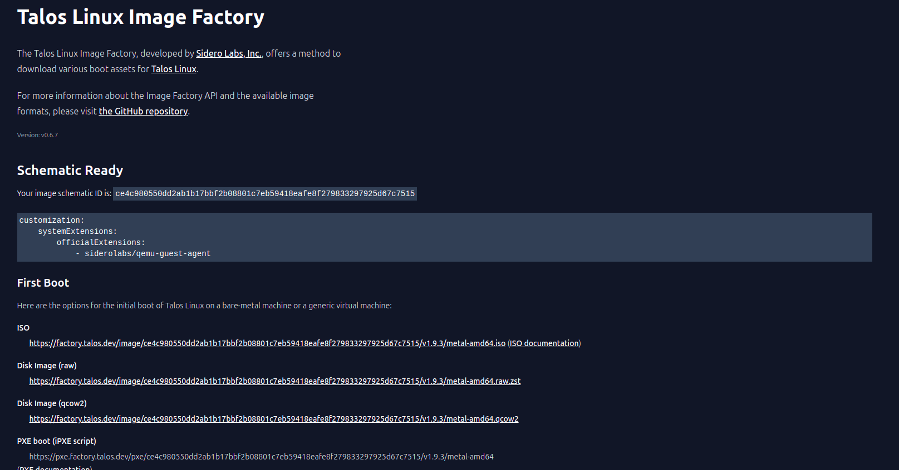
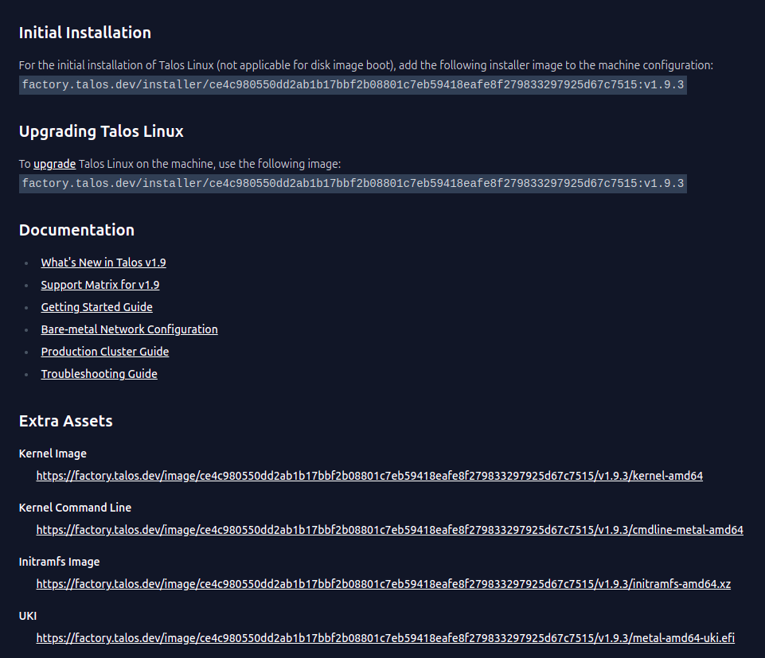

---

## 💿 **3. ISO'yu Proxmox'a Yükleme**

Proxmox arayüzünde **ISO dosyanızı yükleyin**.

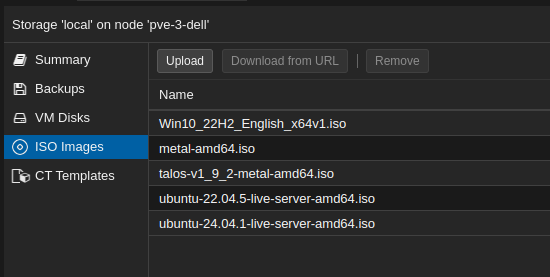
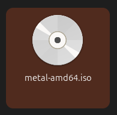
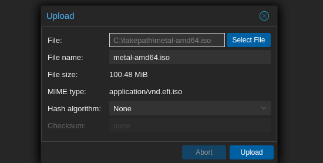

---

## 📌 **4. Sanal Makineleri Oluşturma**

Talos için bir sanal makine oluşturun. Sistem gereksinimlerinizi **CPU, RAM ve Disk** ihtiyacınıza göre belirleyin.

**Örnek yapılandırma:**

### **Genel Ayarlar**
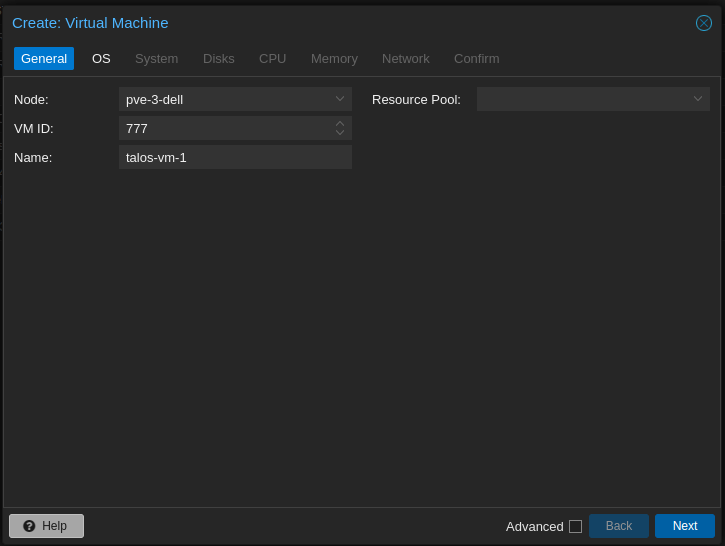

### **İşletim Sistemi Seçimi**
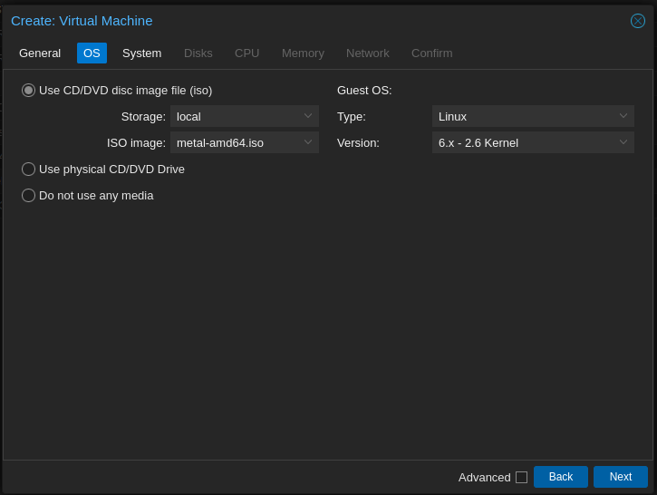

### **Sistem Konfigürasyonu**
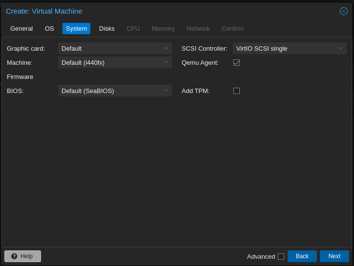

### **Disk Yapılandırması**
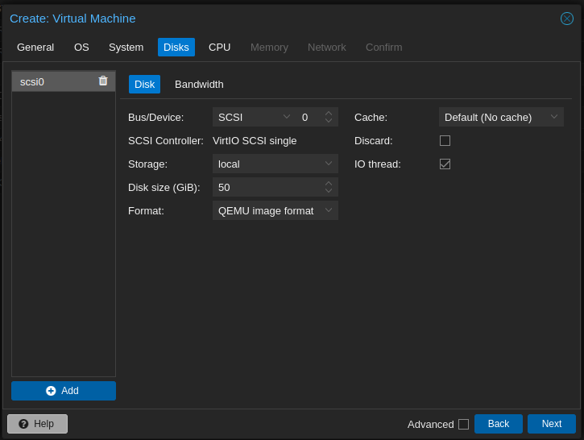

### **CPU Ayarları**
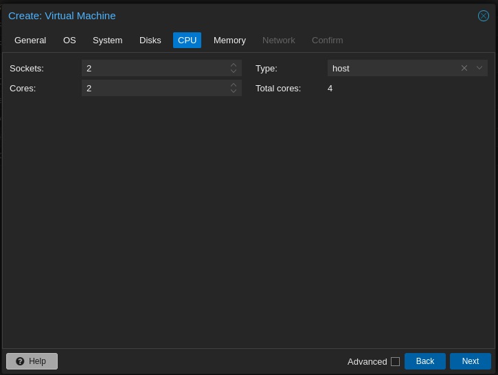

### **Bellek (RAM) Ayarları**
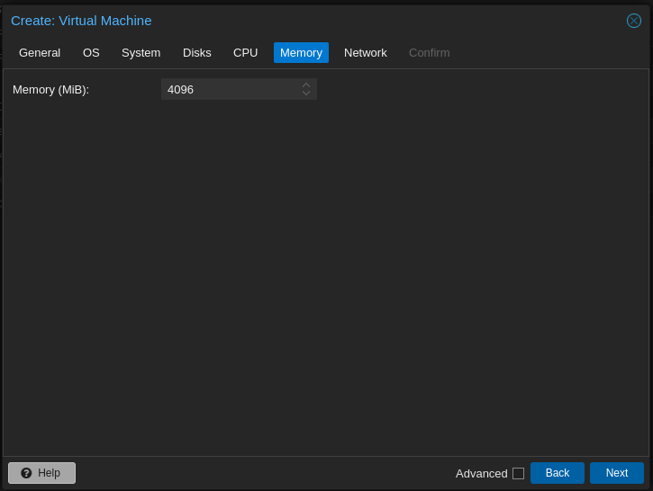

Kurulumu onaylayın ve başlatın:

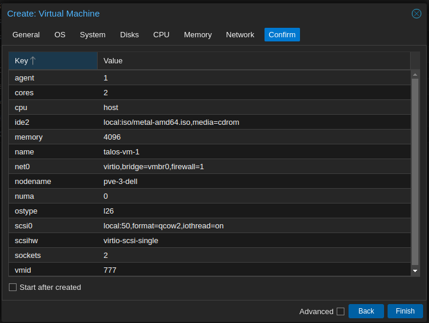

ISO'yu ekleyin:

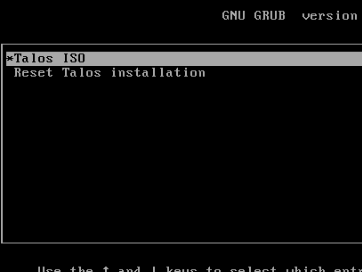

Bakım modunda başlatın:

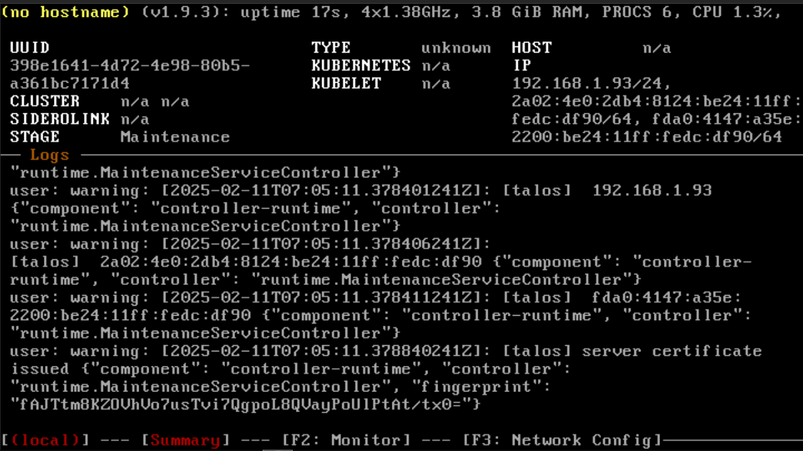

---
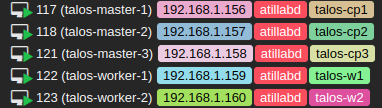
---
## 🌍 **5. Ağ Bağlantısını Test Etme**

VM'nin ağ bağlantısını kontrol edin:

```bash
ping 192.168.1.156
```

---

## 🔧 **6. Talos Yapılandırması**

Talos yapılandırma dosyalarını oluşturmadan önce disklerinizi kontrol edip hangi diske bağlı olduğunu öğrenmeniz gerekir;
```bash
talosctl get disks --insecure --nodes 192.168.1.156
```
```bash
NODE   NAMESPACE   TYPE   ID      VERSION   SIZE     READ ONLY   TRANSPORT   ROTATIONAL   WWID   MODEL           SERIAL
       runtime     Disk   loop0   1         4.1 kB   true                                                        
       runtime     Disk   loop1   1         684 kB   true                                                        
       runtime     Disk   loop2   1         74 MB    true                                                        
       runtime     Disk   sda     1         54 GB    false       virtio      true                QEMU HARDDISK   
       runtime     Disk   sr0     1         105 MB   false       ata                             QEMU DVD-ROM    

```

Talos yapılandırma dosyalarını oluşturun:

```bash
talosctl gen config talos-proxmox-cluster https://192.168.1.156:6443 --output-dir _out --install-disk /dev/sda
```

Yapılandırmayı uygulayın:

```bash
talosctl apply-config --insecure --nodes 192.168.1.156 --file _out/controlplane.yaml
```

---

## ⚙ **7. Talos Ayarlarını Yapılandırma**

```bash
export TALOSCONFIG="_out/talosconfig"
talosctl config endpoint 192.168.1.156
talosctl config node 192.168.1.156
```

```bash
talosctl config view
```

```bash
talosctl config info
```

---

## 🎛 **8. Talos Arayüzünü Başlatma**

Talos kontrol panelini başlatın:

```bash
talosctl dashboard
```

Talos kümesini başlatın:
- Bootstrap Etcd 

```bash
talosctl bootstrap
```
kubeconfig yükleyin:
```bash
talosctl kubeconfig .
```

Mevcut üyeleri listeleyin:

```bash
talosctl get members
```

---

## 🌐 İkinci Kontrol Düzlemi (Control Plane) Ekleme

İkinci Talos düğümünü (node) ekleyin:

```bash
ping 192.168.1.157
```

Ayarları yapılandırın:

```bash
talosctl config endpoint 192.168.1.156 192.168.1.157
talosctl config node 192.168.1.156 192.168.1.157
```

Yapılandırmayı uygulayın:

```bash
talosctl apply-config --insecure --nodes 192.168.1.157 --file _out/controlplane.yaml
```
---
## 🌐 Üçüncü Kontrol Düzlemi (Control Plane) Ekleme

İkinci Talos düğümünü (node) ekleyin:

```bash
ping 192.168.1.158
```

Ayarları yapılandırın:

```bash
talosctl config endpoint 192.168.1.156 192.168.1.157 192.168.1.158
talosctl config node 192.168.1.156 192.168.1.157 192.168.1.158
```

Yapılandırmayı uygulayın:

```bash
talosctl apply-config --insecure --nodes 192.168.1.158 --file _out/controlplane.yaml
```
---
## 🌐 Worker Node 1 Ekleme

Birinci Talos düğümünü (node) ekleyin:

```bash
ping 192.168.1.159
```

Worker node'lar için worker.yaml dosyasını kullanarak yapılandırmayı uygulayın:

```bash
talosctl apply-config --insecure --nodes 192.168.1.159 --file _out/worker.yaml
```

Tüm node'ları kontrol edin:
```bash
talosctl get members
```
```bash
NODE            NAMESPACE   TYPE     ID              VERSION   HOSTNAME        MACHINE TYPE   OS               ADDRESSES
192.168.1.156   cluster     Member   talos-cp2       3         talos-cp2       controlplane   Talos (v1.9.3)   ["192.168.1.157","2a02:4e0:2db4:8124:be24:11ff:fe05:b044","fda0:4147:a35e:2200:be24:11ff:fe05:b044"]
192.168.1.156   cluster     Member   talos-cp3       3         talos-cp3       controlplane   Talos (v1.9.3)   ["192.168.1.158","2a02:4e0:2db4:8124:be24:11ff:fe47:6a7f","fda0:4147:a35e:2200:be24:11ff:fe47:6a7f"]
192.168.1.156   cluster     Member   talos-zsp-58e   1         talos-zsp-58e   controlplane   Talos (v1.9.3)   ["192.168.1.156","2a02:4e0:2db4:8124:be24:11ff:fe5f:2223","fda0:4147:a35e:2200:be24:11ff:fe5f:2223"]
```
---
## 🌐 Worker Node 2 Ekleme

Birinci Talos düğümünü (node) ekleyin:

```bash
ping 192.168.1.160
```

Worker node'lar için worker.yaml dosyasını kullanarak yapılandırmayı uygulayın:

```bash
talosctl apply-config --insecure --nodes 192.168.1.160 --file _out/worker.yaml
```

Tüm node'ları kontrol edin:
```bash
talosctl get members
```
---

## 📦 Kubernetes Cluster'ı Kontrol Etme
```bash
kubectl --kubeconfig kubeconfig get nodes
```
Çıktı şu şekilde olmalıdır: Örnektir;
```bash
NAME            STATUS   ROLES           AGE   VERSION
talos-48m-k00   Ready    <none>          17h   v1.32.1
talos-cp2       Ready    control-plane   21h   v1.32.1
talos-cp3       Ready    control-plane   17h   v1.32.1
talos-mvh-q3a   Ready    <none>          17h   v1.32.1
talos-zsp-58e   Ready    control-plane   21h   v1.32.1
```

```bash
kubectl --kubeconfig kubeconfig get node -o wide
```
```bash
NAME            STATUS   ROLES           AGE   VERSION   INTERNAL-IP     EXTERNAL-IP   OS-IMAGE         KERNEL-VERSION   CONTAINER-RUNTIME
talos-48m-k00   Ready    <none>          17h   v1.32.1   192.168.1.160   <none>        Talos (v1.9.3)   6.12.11-talos    containerd://2.0.2
talos-cp2       Ready    control-plane   21h   v1.32.1   192.168.1.157   <none>        Talos (v1.9.3)   6.12.11-talos    containerd://2.0.2
talos-cp3       Ready    control-plane   17h   v1.32.1   192.168.1.158   <none>        Talos (v1.9.3)   6.12.11-talos    containerd://2.0.2
talos-mvh-q3a   Ready    <none>          17h   v1.32.1   192.168.1.159   <none>        Talos (v1.9.3)   6.12.11-talos    containerd://2.0.2
talos-zsp-58e   Ready    control-plane   21h   v1.32.1   192.168.1.156   <none>        Talos (v1.9.3)   6.12.11-talos    containerd://2.0.2

```
Podları görüntüleyin:

```bash
kubectl --kubeconfig kubeconfig get pod -A -o wide
```
```bash
kubectl --kubeconfig kubeconfig get pod -A
```
```bash
NAMESPACE     NAME                                    READY   STATUS    RESTARTS      AGE
kube-system   coredns-578d4f8ffc-92wmq                1/1     Running   0             21h
kube-system   coredns-578d4f8ffc-tlhc8                1/1     Running   0             21h
kube-system   kube-apiserver-talos-cp2                1/1     Running   0             21h
kube-system   kube-apiserver-talos-cp3                1/1     Running   0             17h
kube-system   kube-apiserver-talos-zsp-58e            1/1     Running   0             21h
kube-system   kube-controller-manager-talos-cp2       1/1     Running   0             21h
kube-system   kube-controller-manager-talos-cp3       1/1     Running   0             17h
kube-system   kube-controller-manager-talos-zsp-58e   1/1     Running   2 (21h ago)   21h
kube-system   kube-flannel-46mfw                      1/1     Running   0             17h
kube-system   kube-flannel-9zgzj                      1/1     Running   0             17h
kube-system   kube-flannel-cxxmp                      1/1     Running   0             21h
kube-system   kube-flannel-hp6t4                      1/1     Running   0             21h
kube-system   kube-flannel-l9pct                      1/1     Running   0             17h
kube-system   kube-proxy-572dx                        1/1     Running   0             17h
kube-system   kube-proxy-5n5sn                        1/1     Running   0             17h
kube-system   kube-proxy-9q4dj                        1/1     Running   0             17h
kube-system   kube-proxy-dg4xn                        1/1     Running   0             21h
kube-system   kube-proxy-rh2vs                        1/1     Running   0             21h
kube-system   kube-scheduler-talos-cp2                1/1     Running   0             21h
kube-system   kube-scheduler-talos-cp3                1/1     Running   0             17h
kube-system   kube-scheduler-talos-zsp-58e            1/1     Running   3 (21h ago)   21h

```

Talos panellerini kontrol edin:

Bu komut ile dashboardları açıp ok tuşları ile istediğiniz dashboard u görüntüleyebilirsiniz.

```bash
talosctl dashboard
```

```bash
talosctl dashboard -n 192.168.1.156
talosctl dashboard -n 192.168.1.157
talosctl dashboard -n 192.168.1.158
talosctl dashboard -n 192.168.1.159
talosctl dashboard -n 192.168.1.160
```


### **Control Plane 1**
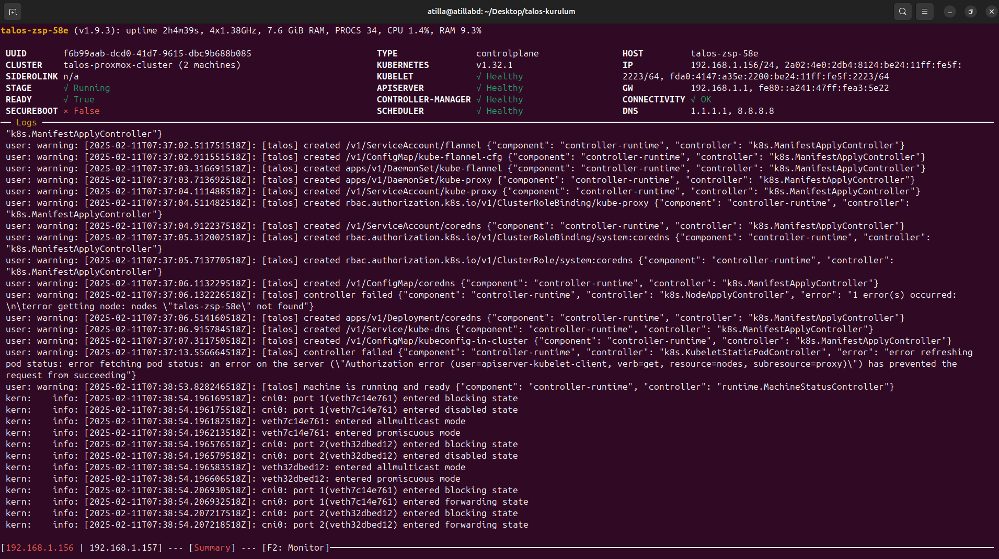

### **Control Plane 2**
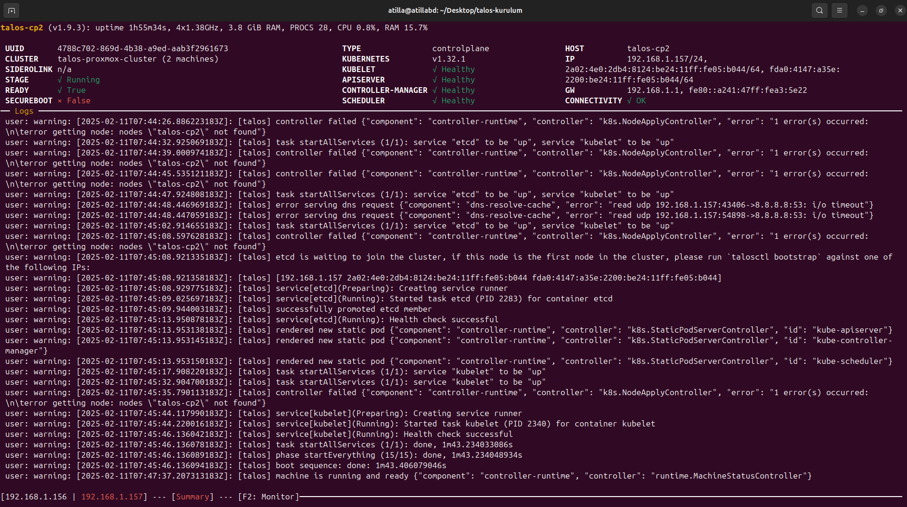

### **Control Plane 3**
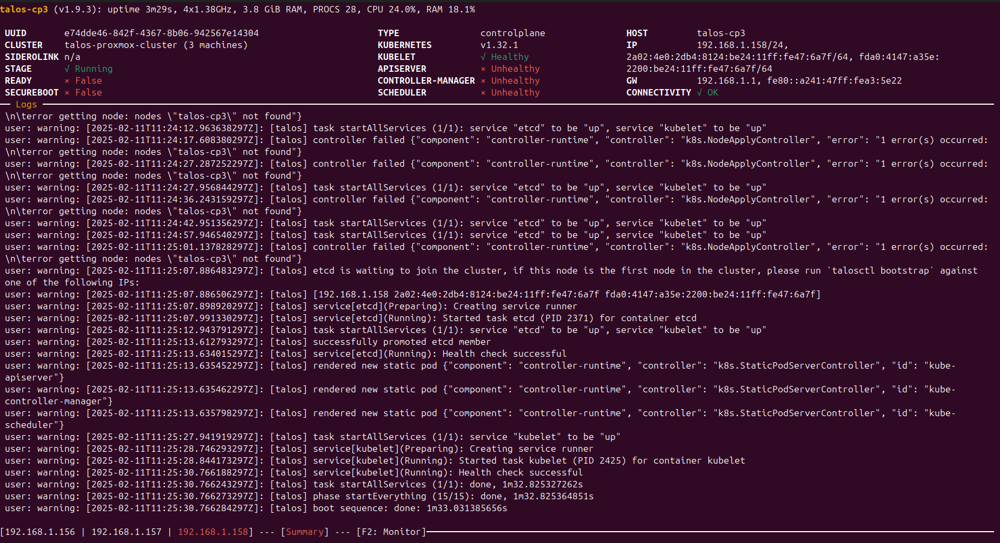
---

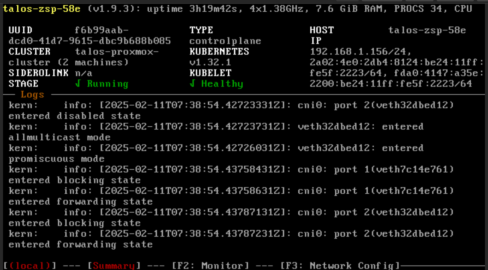
---

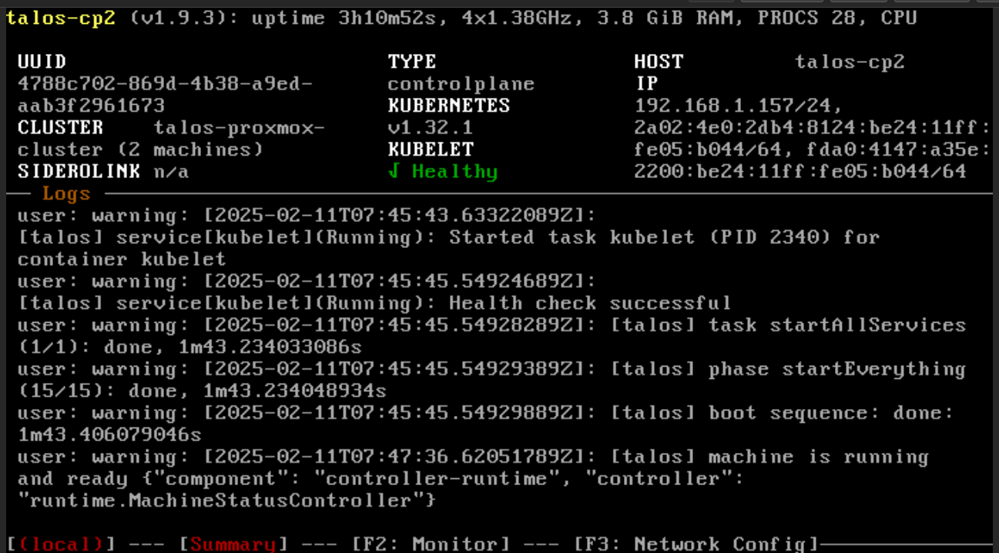
---

## 📦 Kubernetesi Kontrol Etme

```bash
vim _out/controlplane.yaml
```

```bash
vim ~/.bashrc
source ~/.bashrc
```


---
## <> Terminal Kapanınca Ayarlarınızın Gitmemesi İçin Yapılması Gerekenler

Eğer terminali her kapatıp açtığınızda `TALOSCONFIG` değişkeniniz sıfırlanıyorsa, bu ayarı kalıcı hale getirmek için aşağıdaki adımları uygulayabilirsiniz.

### 1. `TALOSCONFIG` Değişkenini Kalıcı Hale Getirme
Terminal oturumları arasında `TALOSCONFIG` değişkenini saklamak için `~/.bashrc` dosyanıza aşağıdaki satırı ekleyin:

```bash
echo 'export TALOSCONFIG="_out/talosconfig"' >> ~/.bashrc
```

Bu komut, `TALOSCONFIG` değişkenini `~/.bashrc` dosyanıza ekler. Bu sayede terminal her açıldığında değişken otomatik olarak yüklenecektir.

### 2. Değişiklikleri Uygulama
Eklediğiniz değişikliği hemen uygulamak için aşağıdaki komutu çalıştırabilirsiniz:

```bash
source ~/.bashrc
```

Bu komut, `.bashrc` dosyanızı yeniden yükleyerek değişikliklerin etkili olmasını sağlar.

### 3. Doğrulama
Ayarlamaların doğru şekilde yapıldığını kontrol etmek için terminali kapatıp yeniden açın ve aşağıdaki komutu çalıştırın:

```bash
echo $TALOSCONFIG
```

Eğer `_out/talosconfig` çıktısını görüyorsanız, değişiklikler başarılı bir şekilde kaydedilmiş demektir.

Artık terminal her açıldığında `TALOSCONFIG` değişkeniniz otomatik olarak yüklenecektir!


---

## 📚 **Kaynaklar**

- [Talos Docs](https://www.talos.dev/v1.9/talos-guides/install/virtualized-platforms/proxmox/)
- [Talos Factory](https://factory.talos.dev/)
- [Virtualization How-To](https://www.virtualizationhowto.com/2024/01/proxmox-kubernetes-install-with-talos-linux/)

---

